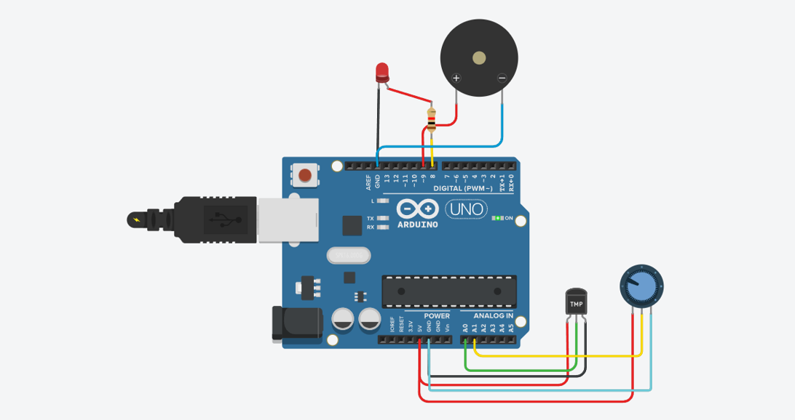

# IIoT Monitoring (Simulation + Dashboard)

    

This project simulates industrial devices publishing telemetry and status to MQTT with HTTP fallback.
FastAPI ingests, validates, normalizes, stores time-series data in TimescaleDB, and streams to WebSocket clients.
Streamlit provides live/history monitoring while Prometheus + Grafana deliver operational observability.

## Architecture (Simple)

```text
                 +---------------------------+
                 |   Docker: Mosquitto MQTT |
                 |   tcp://localhost:1883    |
                 +-------------+-------------+
                               |
                               | iiot/<device>/telemetry + status
                               v
+-------------------+      +-----------------------------+      +----------------------+
| Simulator (Python)| ---> | FastAPI Backend             | ---> | Streamlit Dashboard  |
| multi-device      | HTTP | REST + WS + /metrics + JSON | HTTP | live/history + alarms|
| fault injection   | POST | /telemetry/* /alarms /devices| JSON| localhost:8501       |
+-------------------+      +---------------+-------------+      +----------------------+
                                            |
                                            v
                                 +---------------------+
                                 | TimescaleDB         |
                                 | telemetry/alarms/dev|
                                 +---------------------+

Prometheus scrapes backend metrics; Grafana provides the operational dashboard.
```

## Circuit Diagram



## Dashboard / Output Screenshot

)

## Protocol & Data Flow

- Primary ingest: MQTT topics `iiot/<device_id>/telemetry` and `iiot/<device_id>/status`.
- Fallback ingest: HTTP `POST /v1/telemetry`.
- Query APIs: `GET /telemetry/latest`, `GET /telemetry/range`, `GET /alarms`, `GET /devices`.
- Live streaming: WebSocket `WS /v1/stream`.
- Persistence: TimescaleDB stores telemetry + alarms + device registry.
- Alerts: severity and alarm status are generated by simulator fault logic and persisted.

## Prerequisites

- Python 3.11+
- Docker Desktop

## How to Run

1) Copy environment template

```bash
cp .env.example .env
```

2) Start full stack

```bash
docker compose up --build -d
```

3) Open services

- Backend health: `http://127.0.0.1:8000/health`
- Dashboard: `http://localhost:8501`
- Prometheus: `http://localhost:9090`
- Grafana: `http://localhost:3000` (admin/admin by default)

4) Optional local dev (without Docker for app code)

```bash
cd iiot-monitoring-simmk
python -m venv venv
# PowerShell
.\venv\Scripts\Activate.ps1
# Git Bash
source venv/Scripts/activate
pip install -r requirements.txt
uvicorn backend.app.main:app --host 0.0.0.0 --port 8000 --reload
python simulator/main.py
streamlit run dashboard/app.py
```

### Local Run (PowerShell, no Docker)

Use three PowerShell terminals.

Terminal 1 (Backend):

```powershell
cd D:\ICT\project-1
.\.venv\Scripts\Activate.ps1
pip install -r .\iiot-monitoring-simmk\requirements.txt
cd .\iiot-monitoring-simmk\backend
$env:DATABASE_URL = "sqlite+aiosqlite:///../iiot_local.db"
$env:MQTT_ENABLED = "false"
python -m uvicorn app.main:app --host 0.0.0.0 --port 8000
```

Terminal 2 (Simulator):

```powershell
cd D:\ICT\project-1
.\.venv\Scripts\Activate.ps1
cd .\iiot-monitoring-simmk
$env:BACKEND_URL = "http://127.0.0.1:8000/v1/telemetry"
$env:MQTT_ENABLED = "false"
$env:HTTP_FALLBACK = "true"
python .\simulator\main.py
```

Terminal 3 (Dashboard):

```powershell
cd D:\ICT\project-1
.\.venv\Scripts\Activate.ps1
cd .\iiot-monitoring-simmk\dashboard
python -m streamlit run app.py --server.address 0.0.0.0 --server.port 8501
```

Important: in terminals, copy only raw commands. Do not paste Markdown-style text like `[app.py](...)`.

## Service URLs

- Backend health: `http://127.0.0.1:8000/health`
- Latest telemetry: `http://127.0.0.1:8000/telemetry/latest`
- Telemetry range: `http://127.0.0.1:8000/telemetry/range`
- Alarms: `http://127.0.0.1:8000/alarms`
- Devices: `http://127.0.0.1:8000/devices`
- Metrics: `http://127.0.0.1:8000/metrics`
- Dashboard: `http://localhost:8501`
- Prometheus: `http://localhost:9090`
- Grafana: `http://localhost:3000`

## How to Verify

```bash
curl http://localhost:8000/health
curl "http://localhost:8000/telemetry/latest?limit=10"
curl "http://localhost:8000/devices"
curl http://localhost:8000/metrics
```

Expected:
- `/health` returns `ok` or `degraded` with DB/MQTT component status.
- `/telemetry/latest` and `/devices` return multi-device records once simulator runs.
- `/metrics` exposes Prometheus metrics prefixed with `iiot_`.

## GitHub About (copy/paste)

- Description: `Production-oriented IIoT monitoring platform with MQTT + REST ingest, TimescaleDB persistence, FastAPI streaming APIs, Streamlit dashboard, and Prometheus/Grafana observability.`
- Topics: `iot`, `iiot`, `mqtt`, `fastapi`, `streamlit`, `docker`, `monitoring`, `simulation`, `timescaledb`, `prometheus`, `grafana`, `websocket`, `telemetry`, `devops`

## Operations Docs

- Architecture: `docs/ARCHITECTURE.md`
- Runbook: `docs/RUNBOOK.md`
- Monitoring guide: `docs/MONITORING.md`
- Data model: `docs/DATA_MODEL.md`
